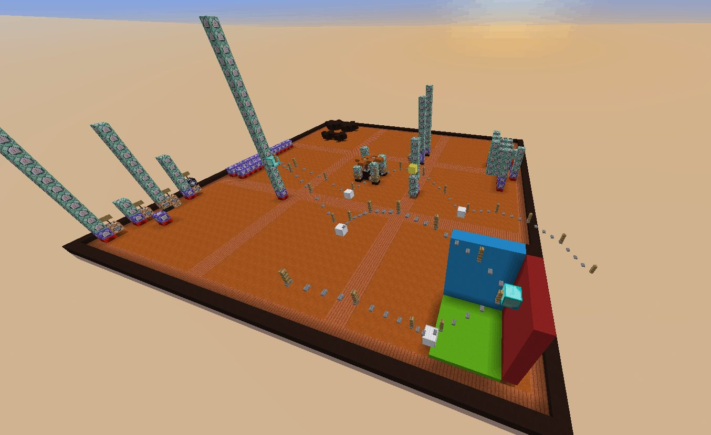

# 1. Les supports des commandes

Bienvenue à toi, jeune explorateur de ce monde sombre et mystérieux qu’est le développement sur Minecraft. En suivant ce guide, tu t’apprêtes à comprendre comment exploiter les commandes et leur potentiel afin de réaliser tout ce que tu peux imaginer, et plus encore.

Avant même de prendre connaissance des différents aspects du développement, nous allons définir ce que signifie “développer” et étudier le support qui va servir tout au long de ce guide afin d’écrire notre “code”.

---

## Développer ? Ça veut dire quoi exactement ?

Au sens large, il s’agit simplement de réaliser/concrétiser une idée/un concept. Dans notre cas, nous parlons d’un cas particulier de développement qui prend la forme d’un langage informatique. Pour ceux à qui ce terme fait peur, il s’agit simplement d’instructions que l’ordinateur (et plus précisément ici, Minecraft) peut comprendre. Par exemple: “téléporte ce creeper sur ce squelette”. Le problème c’est que cet exemple, écrit en français, est compliqué à comprendre pour un ordinateur. Il faut qu’il ait une parfaite connaissance de plusieurs choses :

- Le lexique: la/les définition(s) de chacun des mots utilisés
- La syntaxe: la façon dont les phrases sont formées
- La sémantique: Le sens d’un mot au sein de la phrase (un mot peut avoir plusieurs sens selon le contexte)

De plus, le langage courant est plein d’ambiguïtés. Prenons un exemple : Alice loue sa voiture. Est-ce Alice qui loue la voiture à quelqu’un d’autre (dans ce cas, elle la cède à une autre personne) ? Ou est-ce Alice qui loue la voiture de quelqu’un d’autre (où là, elle la prend à quelqu’un d’autre) ? Dans quel sens la machine doit interpréter la phrase ?

C’est pour cela qu’il est important de définir des langages qui sont sans ambiguïté et dont le sens est clair, on parle alors de langage formel (s’opposant au langage courant qui est dit informel).

Pour que Minecraft puisse bien comprendre ce qu’on lui demande, il faut donc utiliser un langage très simple, où un “mot” ne peut pas avoir de double sens, où le lexique est restreint et la syntaxe est mécanique (il y a un nombre très limité, si ce n’est qu’une seule façon de dire quelque chose en particulier).

Prenons un exemple: on souhaite dire à Minecraft “téléporte les Creepers qui sont à moins de 5 blocs de moi vers un squelette au hasard”. Afin que le jeu puisse comprendre cela, il faudra donc entrer la commande:

```
/tp @e[type=Creeper,distance=..5] @e[type=skeleton,limit=1,sort=random]
```

Nous expliquerons dans la suite de ce guide à quoi servent les différentes parties de cette commande.

Certains se posent sans doute déjà la question: “comment on fait pour dire des choses a Minecraft, comment on lui donne les commandes ?”.

Il y a trois moyens de faire ça:

- À la main: Vous pouvez directement envoyer une commande via le chat textuel
- Par command-block: vous pouvez écrire la commande dans un bloc spécial qui, à chaque activation (généralement, par la redstone), exécutera la commande
- Par mcfunction: vous pouvez écrire une liste de commandes à exécuter dans un fichier, puis une fois dans le jeu, vous exécutez la fonction (ce qui va exécuter chacune des commandes les unes après les autres) simplement en l’appelant via une autre commande.

---

## Le chat textuel

On va commencer par le plus simple et le plus rapide: envoyer des commandes “à la main”. Si vous ouvrez votre chat textuel et que vous y entrez “Hello World!”, vous allez simplement envoyer ce message dans le chat, comme à votre habitude. Si en revanche, vous écrivez “/say Hello World!”, cela donnera un résultat similaire, mais votre pseudo sera affiché entre crochets ( [ et ] ) et plus entre chevrons ( < et > ). Cela indique que le message a été envoyé via une commande, ici, le /say.

:::{note}
La présence du slash ‘/’, préfixe de toutes les commandes dans le chat. Ce caractère est obligatoire, il permet, comme vu précédemment, de lever toute ambiguïté entre un simple message, et une commande !
:::

Plus intéressant: vous pouvez marquer “`/execute as @e run say Hello World!`” et vous verrez toutes les créatures présentes sur votre map, ainsi que tous les joueurs crier en concert “Hello World!”. On vous expliquera également à quoi correspond cette commande dans la suite du guide, n’ayez crainte.

Vous pouvez exécuter à peu près n’importe quelle commande via le chat, mais l’intérêt y est souvent limité car cela requiert une action du joueur.

---
## Les blocs de commande

Pendant un temps (avant l’arrivée des mcfunctions), les command-blocks étaient la seule façon d’automatiser l’exécution des commandes. Ces blocs pouvaient accueillir une seule commande, exécutant cette dernière à chaque fois qu’un courant de redstone venait titiller le bloc. Aujourd’hui, les command-blocks ont un peu évolué. Il existe 3 types différents de command-blocks et ils peuvent être activés de différentes manières.

Chacun des types de command-blocks peut ainsi être activé de la manière suivante (ces options sont modifiable via des boutons sur l’interface du command-block):

- Need redstone: le bloc attendra un signal redstone pour se déclencher
- Always active: le bloc considérera qu’un courant de redstone le touche en permanence, même si ce n’est pas le cas.



En plus de ça, vous pouvez choisir d’exécuter une commande en fonction de si la précédente a fonctionné. Vous remarquerez que les command blocks ont une flèche sur 4 de ses côtés, un rond sur le côté où point les flèches et un carré de l’autre. Ce n’est pas anodin, il s’agit là de l’indication du sens du command block. Vous pouvez en effet créer des chaînes de commandes en disposant les command blocks de façon à ce qu’ils se suivent (et que les flèches forment une chemin continu). Une option est donc proposée pour exécuter la commande que si la précédente a bien fonctionné :

- Unconditionnal: s’exécute tout le temps sans réfléchir à la réussite du précédent ou non
- Conditionnal: vérifie que la commande précédente s’est bien exécutée. Si ce n’est pas le cas, le command block ne fait rien et la chaîne continue. Attention, si le command-block suivant est lui aussi en conditional, il s’exécutera si:
    - les deux command-blocks précédents se sont bien exécutés
    - le command-block précédent ne s’est pas exécuté à cause de son paramètre “Conditionnal”

Il est donc déconseillé de placer deux command-blocks en conditionnel l’un après l’autre à moins de savoir exactement ce que vous faites.

:::{note}
Les command-blocks ne se trouvent pas dans l’inventaire créatif. Pour vous en procurer un, il faut que vous exécutiez la commande “/give @s command_block 1”
:::

### Les types de command-blocks

- Impulse: C’est le command-block “de base”. Il s’exécute une fois à chaque signal de redstone. S’il est en “always active”, il ne s’exécutera qu’une seule fois: au moment où cette option a été activée. À noter qu’il est possible de “pick” un bloc (le récupérer en conservant toutes ses propriétés, donc la commande et les paramètres) en appuyant sur le bouton contrôle (CTRL) et sur la molette de la souris lorsque vous visez le bloc. Si ce dernier contient une commande et est en “always active”, la commande s’exécutera à chaque fois que vous poserez le bloc.
- Repeat: Bien plus souvent utilisé que les command-blocks de type Impulse, les command-blocks de type Repeat ont l’avantage d’exécuter la commande à chaque tick temps qu’ils sont alimentés par un courant de redstone (ou en permanence si ils sont en “always active”, cette option est néanmoins déconseillée pour ce type de command-blocks).
- Chain: Les plus utiles mais aussi les plus mal compris, ces command-blocks permettent d’exécuter la commande, au même titre qu’un Impulse, mais à condition qu’il y ait un command-block précédent qui se soit activé (même si la commande n’a pas été correctement exécutée). Ils permettent de faire des… chaînes, comme leur nom l’indique, de commandes, très souvent utile pour organiser ses commandes.

---
## Les MCfunctions

Maintenant, on attaque le plus compliqué, mais aussi le plus utile. Cependant, si vous êtes déjà lassé d’essayer de comprendre tout ce qu’on raconte, vous pouvez vous arrêter là car la suite du guide nécessite d’utiliser ces fonctions que dans les derniers chapitres. Ne vous dégoûtez donc pas tout de suite et revenez plus tard lire cette partie là !

Exécuter une commande, c’est bien. Exécuter une série de commandes, c’est encore mieux ! C’est pour cela que les mcfunctions ont été créées. Ils s’agit grossièrement de fichiers textes dont l’extension (l’habituel “.txt”) a été remplacée par “.mcfunction”. Dans ce fichier, vous pouvez placer différentes commandes les unes à la suite des autres. De là, vous pourrez exécuter toutes les commandes qu’il contient simplement en appelant le fichier !

Quelques petites règles à connaître à propos de ces fichiers:

- Leur nom ne doit contenir que les caractère suivants
    - Des lettres minuscules (a-z)
    - Des tirets (- ou _)
    - Des chiffres (0-9)

souvent résumé en [a-z0-9_-]

- Le fichier doit être placé dans un datapack
    -  Son chemin doit être: “…/<NomDuMonde>/datapack/<NomDuDatapack>/data/<Namespace>/functions/[…/]<VotreFonction>”
- Aucun “/” ne doit être placé avant les commandes
- Pour laisser un commentaire (ligne qui ne sera pas lue par le jeu), mettre “#” devant
- Une erreur dans le fichier rend la fonction totalement incompréhensible pour Minecraft (il fera alors comme si elle n’existait pas). Veillez à vérifier chaque commande que vous ajoutez. Si le fichier n’a pas pu être chargé par le jeu dû à une erreur, Minecraft vous le dira avec un beau message en rouge dans la console du jeu activable dans le launcher de ce dernier : Paramètres/Ouvrir le journal des données quand le jeu démarre.
- Une ligne doit être soit un commentaire, soit une commande, soit vide. Aucun mélange commande/commentaire ou autre type de contenu n’est accepté
- Les commandes exécutées au sein de la fonctions seront par défaut exécutées à la position où elles ont été exécutées et de la part de l’entité ou bloc qui l’a exécuté. Vous comprendrez sans doute mieux ce que ça signifie lorsque vous serez arrivé au chapitre sur les “/execute”. Patience !

:::{note}
L’écriture de mcfunctions peut se faire via n’importe quel éditeur de texte. Cependant, pour faciliter la lecture et l’écriture, nous vous recommandons d’utiliser Notepad++ ainsi que notre extension de coloration syntaxique.
:::

Pour exécuter une fonction (et donc toutes les commandes qu’elle contient), il suffit d’entrer la commande:

```
/function <namespace>:<path>
```

Le paramètre `<namespace>` est le même nom que celui que vous avez donné au dossier contenant toutes les fonctions. Le paramètre `<path>` est le chemin d’accès vers la fonction a partir du dossier « functions ».

**Exemple:** Si votre fonction « test.mcfunction » se trouve directement dans le namespace « mapmaking », vous pourrez l’appeler en envoyant la commande

```
/function mapmaking:test
```

Si en revanche la fonction « test.mcfunction » se trouve dans un dossier « exercice » qui lui même se trouve dans « commandes » qui lui même se trouve dans le namespace « mapmaking », il faudra alors exécuter la commande:

```
/function mapmaking:commandes/exercice/test
```

Je vous invite à essayer en plaçant « say 1 » dans le fichier. Si lorsque vous appelez la fonction, vous voyez 1 apparaitre dans le chat, c’est que tout fonctionne ! Autrement, vous avez dû louper quelque chose. Lorsque vous avez plusieurs fonctions, n’hésitez pas à utiliser votre touche ‘tab’ lorsque vous commencerez à écrire votre appel de fonction (exemple: vous écrivez « /function ma » puis vous pressez ‘tab’). Cela vous permettra de remplir automatiquement le nom des fonctions présentes et considérées par le jeu pour vous faire gagner du temps.

---
## Retour de commandes

Comme vous l’avez vu plus haut, les command-blocks ont un système bien pratique permettant d’exécuter une commande sous la seule condition que la commande qui la précède s’est bien exécutée. Cela permet donc de faire des conditionnels (s’apparentant aux “if” des langages de programmation classiques) ce qui peut s’avérer très pratiques !

Néanmoins, peut-être vous posez-vous la question de savoir s’il est possible de faire de même avec des mcfunctions ? En effet, il serait très utile d’avoir un système similaire de façon à pouvoir se débarrasser définitivement de ces blocs ! Et je vous rassure, il existe bel et bien un moyen de faire cela, mais pour ça, il faut d’abord connaître une petite particularité technique des commandes : le retour des commandes.

Alors en effet, ça sonne un peu comme un nom de film à la Star Wars, mais ça n’a strictement rien à voir. Par retour, j’entends une ou des valeurs que la commande nous donne après son exécution. Chaque commande peut donc retourner deux valeurs :

- la première est un chiffre pouvant être 1 (vrai) ou 0 (faux) répondant à la question “La commande s’est-elle bien exécutée ?” que l’on appelle valeur de succès (Success).
- La seconde est une valeur résultat (Result), il s’agit d’un nombre renvoyé par la commande permettant d’obtenir des informations sur l’exécution de cette dernière.

Cette dernière est un peu plus compliqué à comprendre car elle dépend vraiment de la commande exécutée et de son contexte d’exécution, mais je vais tout de même vous donner quelques exemples pour vous montrer le potentiel :

Prenons la commande /list, qui permet d’afficher le pseudo de tous les joueurs connectés sur un serveur. Cette dernière aura pour valeur Success 1 si au moins un joueur est connecté (et donc que l’on peut afficher des joueurs) et 0 sinon, et aura pour valeur de Result le nombre de joueurs sur le serveur. Et voici donc un moyen très simple de compter le nombre de joueurs, pratique, non ?

Voici un autre exemple : la commande /time query daytime. Cette comme-ci aura constamment 1 pour Success (vu qu’elle ne peut pas échouer) et aura le nombre de ticks écoulés depuis le début de la journée pour Result, très pratique donc pour savoir à quelle phase de la journée nous sommes.

Comme vous le voyez, chaque commande a vraiment son propre Result mais bien heureusement, il existe une page qui répertorie les valeurs retournées en fonction de la commande exécutée sur le Wiki français de Minecraft !

Comme vous pouvez le voir, les commandes peuvent apporter des informations très intéressantes sur leur exécution, informations qui peuvent bien entendu être exploitées en les enregistrant notamment dans un scoreboard mais nous verrons cela dans les articles à venir ;)