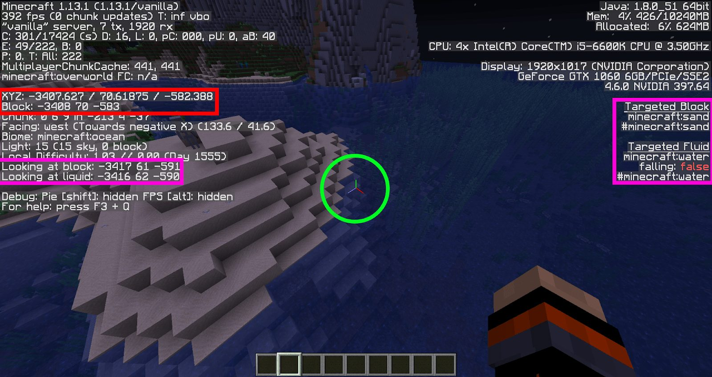
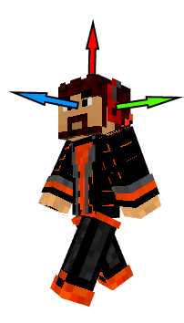
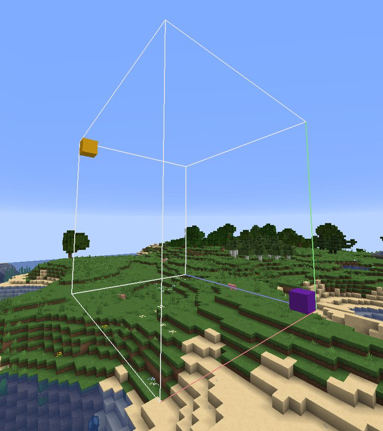

# 2. Blocs & Entités

Maintenant que nous avons vu les différents supports de commandes, nous allons commencer à rentrer dans le vif du sujet en parlant des différents objets que vous allez manipuler.

Si vous avez une vague connaissance à propos du fonctionnement d’un jeu vidéo, vous devriez être au courant qu’il existe plusieurs types d’objets (pour ceux qui s’y connaissent vraiment dans le domaine, il s’agit là d’une liste non exhaustive évidemment).

- **L’environnement** constitué ici de blocs, qui sont des formes géométriques de base. Ces derniers sont persistants, c’est-à-dire que chaque modification apportée à ces blocs restera telle quelle jusqu’à ce qu’une autre modification vienne changer leur état.
- **Les entités** constituent toute la partie “active” d’un jeu et sont à l’origine de la plupart des actions de ce dernier. Dans Minecraft, il s’agit de créatures, qu’elles soient gentilles, neutres, méchantes ou encore des joueurs !
- **Les particules** permettent de faire des effets visuels et de dynamiser le jeu (en plus des animations appliquées à ces 3 types d’objets).

Ce qui va nous intéresser aujourd’hui, c’est est de voir comment sont construits ces objets et comment on peut les manipuler. Vu que la manipulation est pour chaque objet dissemblable, nous allons séparer ces explications en deux parties.

:::{important}
À savoir : Une particule, à la différence des blocs et entités, ne peut être ni modifiée ni même être détecté une fois créée. Elle ne possède donc pas de sélecteur et ne peut, dans Minecraft, pas être « gérée » après sa création. Nous ne parlerons donc pas des particules car leur utilisation ne se résume qu’à une seule commande (leur création via /particle).
:::

---
## Blocs

### Création

Construire ces objets sera une tâche relativement facile, car chacun possède une commande prévue à cet effet. Ainsi, pour les blocs, cette commande est la suivante :

```
/setblock <position> <type>[blockState][NBT] [replace|destroy|keep]
```

Grâce à elle, vous pouvez poser un bloc à la position donnée. Le “type” correspond au bloc Minecraft que vous souhaitez placer ou, si vous préférez, à son matériau (pierre, terre, bois, etc). Vous remarquerez que seuls les deux premiers paramètres sont obligatoires. Dans la plupart des cas (les cas les plus simples), vous n’aurez donc qu’a vous souvenir de cette syntaxe :

```
/setblock <position> <type>
```

:::{note}
Vous pouvez afficher les identifiants de chacun des blocs grâce au raccourci “F3”, puis en visant le bloc, ou bien par le raccourci “F3 + H”. Son identifiant sera alors affiché sous le nom de l’item pointé par votre souris.
:::

Le dernier paramètre permet de modifier le comportement de la commande. Trois sous-paramètres différents sont disponibles :

- “replace” (paramètre par défaut) : permet de placer le bloc peu importe le bloc d’origine.
- “destroy” : pose le bloc en détruisant le bloc précédent, générant ainsi des particules et lâchant l’item correspondant à ce dernier.
- “keep” : permet de ne placer le bloc que si de l’air se trouvait à la position précisée.

Enfin, “blockState” et “NBT” correspondent aux propriétés du bloc. Le “blockState” définit la forme du bloc si celui-ci en possède plusieurs (orientation, âge de la plante, forme de l’escalier, etc.) tandis que “NBT” est une structure de données définissant les informations stockées par le bloc. Les quelques blocs possédant cette structure sont appelés “Block Entity”, catégorie où l’on peut retrouver entre autres les coffres, les panneaux, les têtes, les jukeboxes, ou les lits. Nous reviendrons sur les NBTs un peu plus tard dans ce guide.

On peut différencier ces deux structures par la façon dont elles sont délimitées. Ainsi le “blockState” se trouvera entre deux crochets “[]” et le “NBT” entre deux accolades “{}”.

Voici un exemple afin de mieux comprendre la syntaxe :

```
/setblock 10 11 12 furnace[lit=true]{Items:[{id:slime_ball,Slot:0,Count:1}]} keep
```

Placera un four à l’apparence allumée et possédant une Slime Ball dans le slot de cuisson aux coordonnées x=10, y=11 et z=12 seulement si le bloc d’origine était de l’air.

### Sélection

Afin de manipuler les blocs, vous aurez à disposition une panoplie de commandes telles que :

- /setblock <position> <type> …
- /fill <position1> <position2> <type> …
- /data merge block <position> …
- /clone <position1> <position2> <position3> …

Vous trouverez l’explication officielle de chacune de ces commandes en cliquant dessus. Ce qui va nous intéresser ici, ce sont les paramètres “<position>”. Tout à l’heure nous avons vu que si nous mettions “10 11 12” dans ce paramètre, notre bloc allait se situer à la position x=10, y=11 et z=12. Mais qu’est-ce que ça signifie exactement ?



En appuyant sur “F3”, plein de données devraient apparaître comme sur l’image ci-dessus. Ces dernières permettent de s’y retrouver plus facilement afin de créer ou débugger un système (ou du moins, c’est de cette façon que nous allons les utiliser). Au centre, vous pouvez voir ce qu’on appelle un repère. Ce dernier contient 3 lignes orientées chacune vers le côté positif de l’axe qu’elle représente :

- Axe rouge: correspond à l’axe X
- Axe vert: correspond à l’axe Y
- Axe bleu: correspond à l’axe Z

Une position sera définie grâce à une valeur sur chacun des axes. Vous pouvez voir en haut à gauche de l’image votre position actuelle (“XYZ: …”) ainsi que la position du bloc dans lequel vous vous trouvez (“Block: …”). Enfin, sur les côtés de l’image, vous pouvez connaître la position et le type de bloc que vous visez, vous permettant de les éditer facilement avec une commande.

:::{note}
Lorsque vous écrivez une commande avec un paramètre permettant de désigner la position d’un bloc, Minecraft vous suggérera toujours le bloc que vous visez. Si vous n’en visez aucun, il vous suggérera votre position actuelle. En appuyant sur ‘tab’, vous pourrez utiliser l’auto-complétion des commandes qui prendra la valeur suggérée.
:::

Bon, connaître la position des blocs c’est bien, mais ça reste assez limité. Si par exemple vous souhaitez placer un bloc à côté d’un joueur, vous allez être embêtés car vous ne connaissez pas la position où vous devez placer le bloc. C’est pour cette raison qu’il existe 3 types de coordonnées :

- **Coordonnées absolues** (ex: 1 2 3) : celle que vous apercevez dans le menu ‘F3’. Si tous les joueurs font un /setblock avec une même coordonnée absolue, chacun d’eux changera le même bloc.
- **Coordonnées relatives** (ex: ~1 ~2 ~3) : ici, ces coordonnées ne dépendent plus de la map en elle-même (et son centre en 0 0 0) mais du joueur (ou entité ou bloc) qui exécute la commande. Ainsi, un “/setblock” avec les coordonnées ~1 ~2 ~3 placera un bloc à proximité de la position où la commande a été exécutée. Si votre position est 20 20 20, le bloc se placera en 21 22 23 (20+1, 20+2 et 20+3). Le nombre est préfixé d’un tilde ‘~’.
- **Les coordonnées locales** (ex: ^1 ^2 ^3) : ces dernières sont plus complexes car dépendant de l’orientation de l’entité ayant exécuté la commande. Ainsi, un “/setblock ^1 ^2 ^3 stone” placera un bloc de pierre 1 bloc à gauche du joueur, 2 blocs au-dessus de sa tête et 3 blocs devant lui.
    :::{warning}
    Si le joueur regarde le ciel, 2 blocs au-dessus de la tête du joueur correspondront à 2 blocs derrière son corps joueur car sa tête et son corps sont orientés différemment et nous parlons bien ici de l’orientation de sa tête. Le nombre est préfixé d’un accent circonflexe.
    :::

<div align=center>



</div>

:::{note}
Ce système de coordonnées ne fonctionne pas seulement pour placer un bloc ou sélectionner un bloc mais bien pour toutes autres commandes nécessitant une position pour paramètre. Note : Il est possible de mélanger les 2 premiers types de coordonnées dans un même paramètre (ex: 10 ~11 12).
:::

Enfin, vous vous demandez sûrement pourquoi dans certaines commandes comme le “/fill”, il y a deux paramètres “position”. Il s’agit en fait d’un moyen  pour sélectionner une zone de blocs et non un seul bloc. Vous devrez donc sélectionner la position des deux extrémités de votre zone (qui prend la forme d’un parallélépipède rectangle), à savoir celle du bloc violet et celle du bloc jaune sur l’image ci-dessous.



:::{note}
Pour la commande “/clone”, un troisième paramètre “” est demandé. Ce dernier sert à définir la position à laquelle la zone sélectionnée par les deux premiers paramètres sera placée. La zone se placera alors de sorte à ce que son extrémité ayant les coordonnées les moins élevées correspond avec les coordonnées données dans ce troisième paramètre. Dans l’image ci-dessus, la zone se placera de façon à ce que le bloc violet soit placé aux coordonnées précisées dans le , comme nous le montre le repère placé sur la boîte délimitant la zone. 
:::

---
## Entités

### Création

Maintenant que nous avons vu comment créer et modifier l’environnement, nous allons nos attaquer aux entités. Ces entités seront le cœur de vos maps car elles représenteront à la fois les pièces mobiles et les éléments actifs rendant votre map dynamique. Afin d’invoquer une entité, nous utiliserons la commande :

```
/summon <type> <position> [NBT]
```

Comme pour les blocs, la position sert à définir où l’entité va être créée. Quant au type, il s’agit cette fois de la nature de l’entité que vous souhaitez invoquer (Creeper, Zombie, Loup etc.). Pour les NBT, un article entier leur sera consacré, nous verrons donc ça plus tard. *Spoiler, ces propriétés serviront à customiser vos créatures (leur donner une armure, un effet de potion etc.).*

:::{note}
Il est impossible d’invoquer un joueur. Leur intelligence est trop complexe pour être créés de cette façon :/
:::

### Sélection

Pour préciser une entité, il faut utiliser ce qu’on appelle un “sélecteur”. Ce dernier existe sous plusieurs formes :

- @e (entity) : permet de sélectionner toutes les entités (joueur ou non) ;
- @a (all) : permet de sélectionner tous les joueurs ;
- @p (proximity) : permet de sélectionner le (ou “les” si un nombre est spécifié entre crochets) joueurs les plus proches de l’endroit où est exécuté la commande (cf. “Les /execute”) ;
- @r (random) : permet de sélectionner un (ou plusieurs si un nombre est spécifié entre crochets) joueur aléatoire ;
- @s (self) : permet de sélectionner l’entité ayant exécuté la commande (cf. “Les /execute”) ;
- <Psuedo> : Peut être utilisée comme raccourcit pour “@a[name=<Pseudo>]” ou comme sélecteur de joueur virtuel (ou “fake player”, correspondant à un pseudo associé à aucun joueur ou à un joueur déconnecté) ;
- * : Sélectionne toutes entités, vivantes ou mortes, connectées ou non, réelles ou virtuelles (là où le @e ne sélectionne “que” les entités réelles vivantes et connectées).

:::{note}
Une bonne partie de ces sélecteurs sont vieux et vous vous rendrez compte que seul le @e, le @s et l’astérisque (*) conservent toujours un véritable intérêt en 1.13 et au-delà. Les autres ne servent désormais qu’à “alléger” les commandes en évitant de devoir écrire certaines conditions.
:::

Ces différents sélecteurs (à l’exception de “<Pseudo>” et de l’astérisque) sont souvent directement suivis de crochets permettant l’ajout de conditions. Par exemple, si vous souhaitez sélectionner jusqu’à 3 joueurs se trouvant entre 5 et 10 blocs de distance de vous, vous n’aurez qu’à utiliser ce sélecteur:

```
@a[distance=5..10,limit=3]
```

:::{note}
Comme dit précédemment, seul le @e et @s ont un réel intérêt. Vous pouvez aussi bien utiliser le sélecteur “@e[type=player,distance=5..10,limit=3]”.
:::

Depuis la version 1.13, les choses sont devenues relativement simples à comprendre. Ici, pas besoin d’expliquer “distance=5..10” pour comprendre que ça ne sélectionne que les entités qui sont entre 5 et 10 blocs de distance. La seule difficulté sera de se rappeler des conditions possibles à utiliser dans ces sélecteurs. Voici une liste des plus fréquemment utilisés :

- x=\<VALEUR>
- y=\<VALEUR>
- z=\<VALEUR>
- distance:\<INTERVALLE>
- dx=\<VALEUR>
- dy=\<VALEUR>
- dz=\<VALEUR>
- type=\<TYPE>
- limit=\<VALEUR>
- sort=\<nearest|random|furthest|arbitrary>
- tag=\<TAG>
- scores={\<SCORE1>=\<INTERVALLE>}

Essayons de voir ce que chacun d’eux permet de faire :

- **“x=…”, “y=…” et “z=…”** permettent d’indiquer une coordonnée absolue (coordonnée qui servira notamment à la condition “distance=”).
- **“distance=…”** sert à définir une… distance. Pour que l’entité valide cette condition, elle doit se trouver dans l’intervalle de distance précisé en valeur (nous y reviendrons un peu plus en détail en dessous). L’intervalle peut être composé de nombre à virgule afin d’augmenter la précision.
- **“dx=…”, “dy=…” et “dz=…”** servent à désigner une distance sur chacun des axes (là où le “distance=” permet de définir une zone sphérique, “dx=”, “dy=” et “dz=” permettent de faire une zone rectangulaire orientée vers le positif).
- **“type=…”** permet de restreindre (ou exclure si vous mettez “type=!…”) à un type d’entité (ex: @e[type=creeper] ne sélectionnera que les creepers)
- **“limit=…”** permet de définir un nombre maximum d’entité à sélectionner.
- **“sort=…”** permet, dans le cas où le nombre d’entités est limité, de définir quelles entités vont être sélectionnés. Ainsi, “nearest” prendra les entités les plus proches, “furthest” prendra les entités les plus lointaines, “random” prendra les entités aléatoirement et “arbitrary” n’appliquera aucun tri rendant donc la commande plus optimisée.
- **“tag=…”** permet de conserver (ou exclure si vous mettez “tag=!…”) les entités portant un tag précis. Nous verrons en quoi consistent les tags dans un autre chapitre.
- **“scores=…”** permet de conserver les entités ayant des scores correspondant à ceux indiqués. Nous verrons en quoi consistent les scores dans un autre chapitre.

La valeur INTERVALLE suit une syntaxe un peu particulière, elle permet de valider la condition si le nombre se trouve entre deux bornes (cas 1) ou s’il est exactement égal au nombre précisé (cas 2) :

- [min]..[max] : Permet donc de valider si le nombre se trouve entre les deux bornes (incluses). Les paramètres sont optionnels car il est possible de ne pas spécifier l’une ou l’autre des bornes de façon à comprendre soit toutes les valeurs plus petites que max soit toutes les valeurs plus grandes que min.
- [valeur] : Permet de valider la condition si le nombre est strictement égal à celui précisé.

Les valeurs bornant l’intervalle peuvent être, si le paramètre l’accepte, des nombres à virgule, mais attention : dans le cas numéro 2, 64 sera différent de 64.001 ! Attention, par convention, les décimales sont séparées des entiers par des points et non des virgules comme nous avons l’habitude en France.

:::{note}
Pour être sélectionnée, l’entité doit répondre à toutes les conditions du sélecteur, il s’agit donc, pour ceux qui ont quelques connaissances en algorithmique ou en électronique, d’un “et logique” entre chaque paramètre. Pour faire un “ou logique” vous devrez passer par un système de commande qui ajoute un tag (ou autres) si telle ou telle condition est validée. Vous exécuterez ensuite la commande si vous détectez la présence de ce tag.
:::

---
## Conclusion

Maintenant, vous maîtrisez les bases des objets manipulables dans Minecraft. Même si pour l’instant, cela peut vous paraître seulement à fin décorative pour votre map ou vos entités, vous vous rendrez assez vite compte que cela peut aussi être un moyen de parvenir à des résultats plus complexes, notamment avec le prochain article qui parlera de la commande 1.13 qui a radicalement changé nos façons de concevoir nos systèmes : la commande exécute.