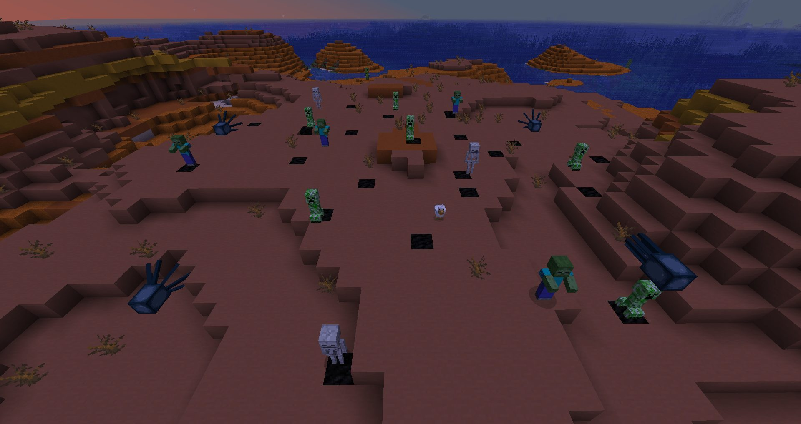

# 3. Les /execute

Aujourd’hui, nous nous attaquons à du gros gibier ! La plupart d’entre vous ont déjà vu cette commande, difficile de passer à côté tant elle est utilisée dans tous les systèmes et à toutes les sauces.

Il s’agit là sans aucun doute de la plus grosse et de la plus utile commande du jeu qui vous permettra d’exécuter d’autres commandes à des endroits précis et par une/des entité(s) précise(s). Si vous n’avez pas suivi le chapitre précédent sur les types d’objet et les sélecteurs, nous vous invitons à aller le lire. Ce chapitre va énormément s’appuyer sur ce qu’on a vu jusque là.

---
## Exemple concret

Imaginons que vous souhaitez tuer tous les creepers qui marchent sur un bloc de charbon et qu’il y a un poulet à proximité SAUF si il y a aussi un poulpe qui se trouve au dessus du creeper (faut pas trop chercher la logique dans ces exemples). Vous aurez donc besoin d’un moyen pour détecter si toutes ces conditions sont réunies. La commande “/execute” vous permettra de faire tout ça en une seule commande. Voici ci-dessous la commande que vous devriez écrire pour faire cela. Le mieux serait que vous essayez de comprendre chaque élément (ces derniers ont tous une couleur différente) pour tenter de visualiser la logique qui se trame derrière. Tout est logique, surtout avec quelques connaissances en anglais mais pas d’inquiétude si vous n’y parvenez pas, on vous explique tout juste après.

Voici une illustration de la situation que nous allons étudier:


```
/execute as @e[type=creeper] at @s if block ~ ~-1 ~ coal_block if entity @e[type=chicken,distance=..10] positioned ~ ~2 ~ unless entity @e[type=squid,distance=..1] run kill @s
```

> Elle est énorme cette commande j’y arriverai jamais !

Pas d’inquiétude, nous vous promettons qu’il n’y a rien de compliqué. Le tout est de bien comprendre que lorsqu’une commande est exécutée, trois choses sont à prendre en compte :

- Qui l’a exécutée 
- Où elle a été exécutée
- Ce qu’elle execute

Gardez bien cette commande sous les yeux, nous allons se baser dessus pour tout vous expliquer.

---
## Position et source de l’execution

En rouge, vous pouvez voir que ça parle de Creepers (ou plus spécifiquement, si vous avez bien suivi le chapitre précédent, on parle ici de TOUS les Creepers). Le “as” (que l’on pourrait traduire par “en tant que”) devant signifie que la commande va être exécuté par tous les Creepers (qui en seront la source). En revanche, on ne sait toujours pas où la commande va être exécutée. Pour cela, on indique via "at @s" qu’il faut que chaque Creeper exécute la commande à l’endroit où il se trouve (rappelez vous, @s signifie l’entité source donc ici, chaque Creeper est la source car la commande s’exécute sur chacun d’eux) avec le mot-clé “at” (signifiant “à” dans le sens de localisation : “à la plage”).


Pour le moment, la commande va être exécutée par les Creepers en surbrillance (définit via le « as ») et à l’endroit où sont placés les points jaunes points jaunes, correspondant à la position des Creepers (définit via le « at »)

---
## Conditions

Bon, jusqu’alors, on a expliqué les deux paramètres de base des “/execute” mais on n’a pas encore vu les conditions. C’est là qu’interviennent les “if” et les “unless”. Pour ceux qui ne parlent pas un mot d’anglais (retournez vite à l’école !), “if” signifie “si” et “unless” signifie “sauf si”. Ainsi, en utilisant "if block ~ ~-1 ~ coal_block", on teste s’il y a un bloc de charbon présent un bloc en-dessous de la position sélectionnée précédemment. Autrement dit, un bloc en-dessous de chacun des creepers (donc le bloc sur lequel ils sont en train de marcher).


Ici, via la première condition, on a limité les Creepers concernés à ceux qui se trouve au dessus d’un bloc de charbon. Les autres ne sont donc plus considérés car ne respectent pas cette condition.

Ensuite avec "if entity @e[type=chicken,distance=..10]", on test si un poulet est présent à proximité (ici, on a mit 10 blocs de distance). Si vous avez bien compris tout ce qu’on a dit jusque là ça devrait être facile à comprendre. Sinon, nous vous invitons à relire une fois pour éclaircir un peu tout ça.


Maintenant, on ne garde que les Creepers qui sont à 10 moins de 10 mètres de distance de la poule et qui respectent les conditions précédentes.

---
## Variation des sources et positions

Maintenant, on s’attaque à un concept un peut particulier: les “/execute” peuvent changer plusieurs fois de position d’exécution au sein d’une même commande. De la même façon, il peuvent aussi changer d’entité qui les exécute. Avec "positioned ~ ~2 ~" on modifie la position où la commande sera exécutée mais cette fois, au lieu d’utiliser la position d’une entité (comme dans le cas du “at”), on utilise des coordonnées. Ces dernières sont marquées d’un tilde (“~”), ce qui signifie qu’elles sont relatives à la position où ce paramètre est exécuté. Dans notre cas, il s’agit toujours de la position de chacun des Creepers. Ainsi, la nouvelle position se trouvera 2 blocs au dessus de la position que nous avions précisée auparavant (et donc, 2 blocs au dessus de chacun des Creepers).


Ici, seul la position d’exécution (représenté par les points jaunes) à changée. Elle se trouve désormais 2 blocs au dessus de chaque Creeper.

On teste du coup la dernière condition (à savoir, on veut que le Creeper ne se fasse pas tuer s’il a un poulpe au dessus de lui) et on utilise pour ça un “unless” qui ne sera validé que si la condition qui suit n’est pas validée (et réciproquement). En utilisant "unless entity @e[type=squid,distance=..1]", on test donc si un Poulpe se trouve dans un rayon de 1 bloc autour de la position où cette condition s’exécute (toujours 2 blocs au dessus de chaque Creeper). Si cette condition est validée, le unless, lui, ne se valide pas, et donc la commande ne s’exécutera pas.


Le Creeper ayant un poulpe au dessus del ui à donc été écarté par la dernière condition. Désormais, toutes les conditions ont été testées, on peut donc voir ici les entités qui vont exécuter la commande et où elle va être exécutée. Ici, il s’agira d’un /kill simple, donc seul la position d’exécution ne sera pas très importante. Mais si il s’agissait d’un /particle, les particules apparaitraient au niveau des points jaunes.

---
## Commande éxecutée

Enfin, après l'instruction "run", on retrouve la commande qui permet de tuer le Creeper (ou plutôt, on tue la source de la commande qui se trouve être le Creeper). On remarque d’ailleurs que cette commande est précédée d’un “run” qui permet à la commande “/execute” de savoir que ce qui suit n’est plus une condition ou une modification du “/execute” mais qu’il s’agit là de la commande finale à exécuter.


Les deux Creepers qui répondaient à toutes les condtions ont été tué par le /kill @s, qui revient à tuer l’entité à l’origine de la commande (donc les dit Creepers)

:::{important}
Pour que la commande après le “run” puisse s’exécuter, il faut que toutes les conditions soient validées. S’il en manque, ne serait-ce qu’une seule, la commande ne s’exécutera pas.
:::

:::{note}
Vous pouvez très bien mettre un autre execute à la suite du “run” ! À vous d’en voir l’utilité…
:::

---
## Exemples simples

Bien entendu, le premier exemple est extrêmement compliqué et il n’arrive que très rarement qu’une situation aussi complexe se présente. Néanmoins, si une telle situation se présente, le mieux est de diviser la commande en regroupant les conditions dans des tags … que nous verrons plus tard. Mais qu’est-ce que ça donnerait en situation réelle ? Voici plusieurs commandes simples qui représentent plus fidèlement l’utilisation classique de la commande. Si vous avez bien compris les différentes parties expliquées plus haut, vous devriez être à même d’analyser ces commandes pour y comprendre le sens.

Tuer tous les creepers qui se rapproche de Boblennon:

```
/execute at Boblennon run kill @e[type=creeper,distance=..5]
```

Faire dire aux Creepers « Je suis un Creeper ! »

```
/execute as @e if entity @s[type=Creeper] run say Je suis un Creeper !
```

Bonus : faire apparaitre des particules de feu sur tous les joueurs

```
/execute as @e[type=zombie] at @e[type=creeper] at @e[type=pig,distance=..5] at @a run particle flame ~ ~ ~ 0 0 0 0.2 10 force
```

> Hein ? Quoi ? Où ? Pourquoi ?

C’était un piège, qui va me permettre de vous faire remarquer quelque chose d’amusant avec les /execute : certaines commandes comme le /say ne s’intéressent qu’à la source. Peu importe où la commande à été executée, de toute façon tout le monde verra le message. D’autre commandes, en revanche, ne s’intéressent qu’à la position. C’est le cas de la commande /particle. Peu importe qui à créé les particules, l’important, c’est qu’elles soient au bon endroit. Ici, le « as @e[type=zombie] » n’a donc aucune importance et peut être retiré. De plus, on voit ici qu’un sélecteur peut dépendre d’un autre. C’est le cas avec le « at @s[type=pig,distance=..5] » dont la distance se réfère à la position précédente … qui n’est autre que la position des creepers juste avant, indiqué par « at @e[type=creeper] ».

:::{warning}
Certaines commandes peuvent toutefois s’intéresser à la fois à la position et à la source. Il est donc généralement recommandé, si vous n’êtes pas sûr de vous, de faire un « as @e[…] » directement suivit d’un « at @s » (ce qui revient à faire un /execute d’avant la 1.13)

> Oui mais … « at @a » du coup ça fait quoi ?

Et bien vu que aucun paramètre n’est précisé, pouvant dépendre des sélécteurs précédents, la commande ne prendra tout simplement pas en compte les sélecteurs précédents. Ils sont donc inutiles également. Le résultat sera donc strictement identique à cette commande-ci:

```
/execute at @a run particle flame ~ ~ ~ 0 0 0 0.2 10 force
```

---
### Arguments

Voici maintenant une petite liste des arguments disponibles pour les “/execute”. La plupart sont assez simple à comprendre (à forcerie si vous parlez un peu anglais). Pour les autres, nous vous invitons à aller visiter la page officielle concernant cette commande:

| Arguments | Syntaxe | Description | Exemple |
|---|---|---|---|
| as | as <entité> | Définit l’exécuteur des du reste de la commande. | “as @e” exécutera la commande en tant que toutes entités sans prendre en considération la position. |
| at | at <entité> | Définit le point d’exécution de la commande en prenant la position, la rotation et la dimension de l’entité. | “at @e” exécutera la commande sur toutes les entités. |
| if | |  Exécute la commande si la condition est remplie. Si vous souhaitez que la commande ne s’exécute pas si une condition est remplie, remplacez “if” par “unless” |
|  | if entity <sélecteur> |  | “if entity @e[type=Creeper]” execute la commande que si un creeper est présent quelque part |
| | if score <selecteur> <score> <</>/<=/>=/matches> | | “if score @s Points >= 10 Constant” exécute la commande si votre score est plus grand que le score que possède le faux joueur appelé “10” dans l’objectif “Constant” (soit, logiquement, 10) |
| | if block <coordonnees> <type> | | “if block ~ ~-1 ~ bedrock” execute la commande si le bloc en dessous de vous est un bloc de bedrock |
| positioned | positioned <position> | Définit les coordonnées d’exécution du reste de la commande. | “positioned 10 10 10” exécutera la commande en 10 10 10. |
| in | in <overworld|the_end|the_nether> | Définit la dimension d’exécution du reste de la commande. | “execute in the_end teleport 10 10 10” téléportera l’entité en 10 10 10 de l’end. |

---
## En savoir plus

Voici une page qui regroupe la totalité de la documentation relative à cette commande. Vous y trouverez énormément d’informations car cette commande est vraiment à la base du Mapmaking et permet de faire énormément de choses. Cet article vous aura apporté, on l’espère, l’essentiel des informations servant à utiliser la commande pour commencer vos maps.

Pour les bilingues (page très complète): https://minecraft.gamepedia.com/Commands/execute
Pour ceux qui ne parlent pas bien anglais: https://minecraft-fr.gamepedia.com/Commandes#execute

Pour les connaisseurs, vous avez peut-être remarqué que nous n’avons pas parlé de toute la partie « store » de la commande. Ne vous en faites pas, il ne s’agit pas d’un oubli, nous en reparlerons en temps voulu lorsque l’on abordera les NBT ;)